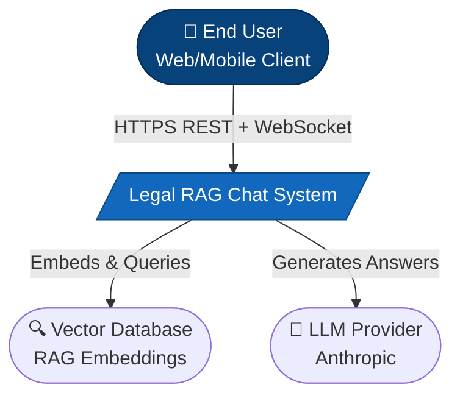
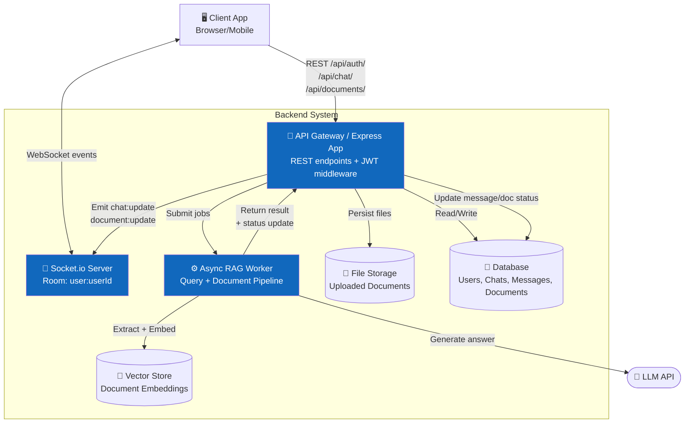
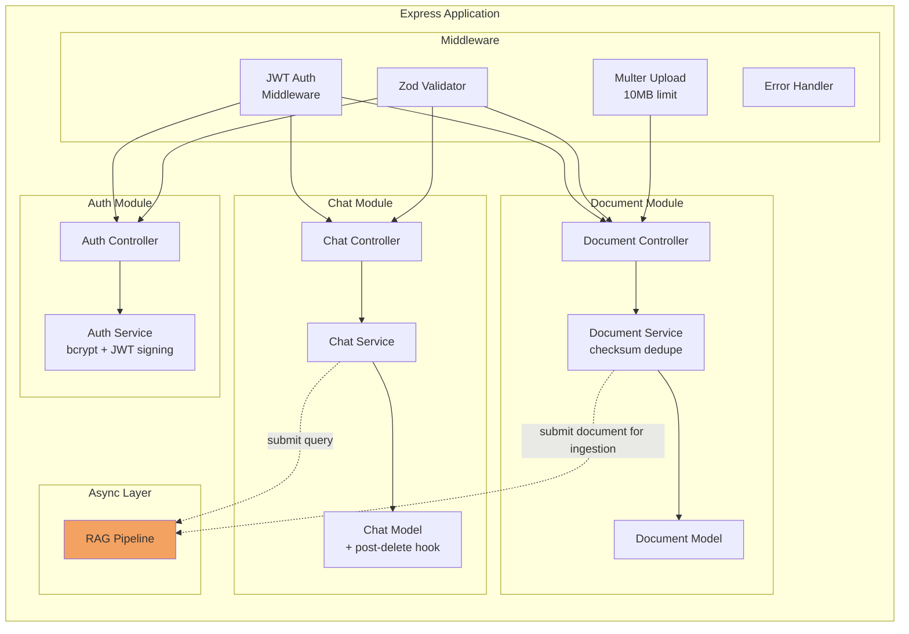
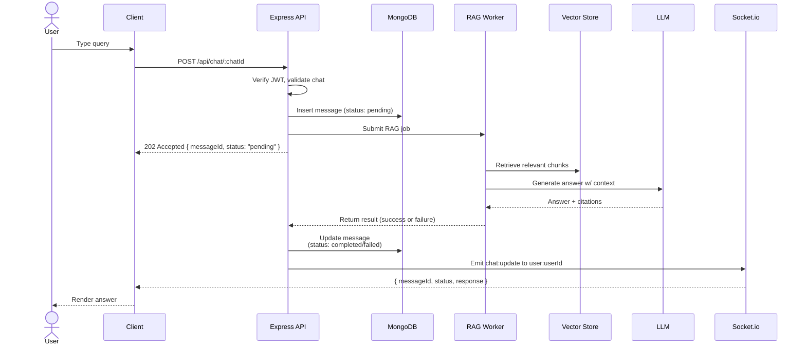
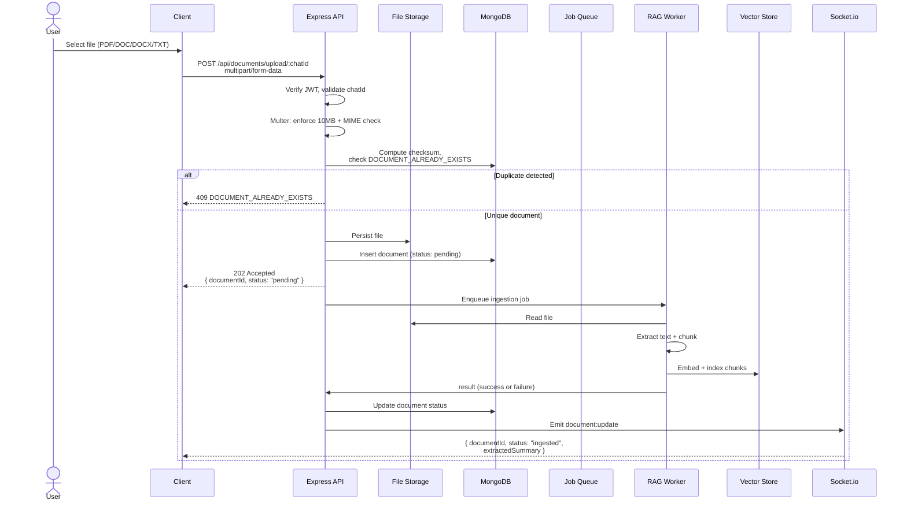
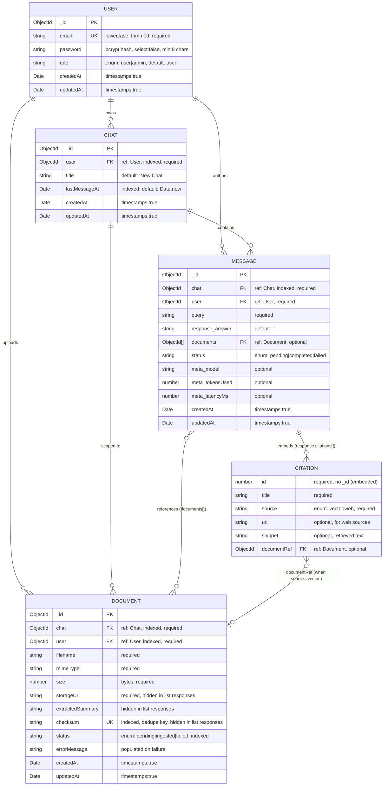

# Backend Architecture Diagrams

---

## 1. System Context Diagram (High-Level)

---

## 2. Container Diagram (Service Boundaries)

---

## 3. Component Diagram — API Layer

---

## 4. Sequence Diagram — Submit Query Flow

---

## 5. Sequence Diagram — Document Upload Flow

---

## 6. Data Model / Entity Relationship

